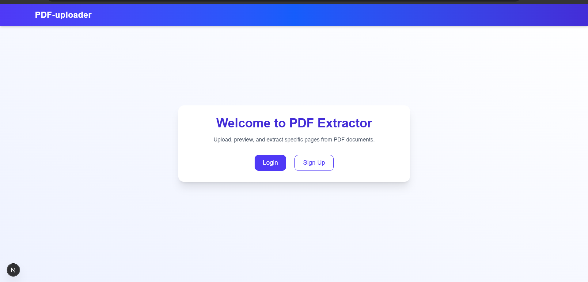
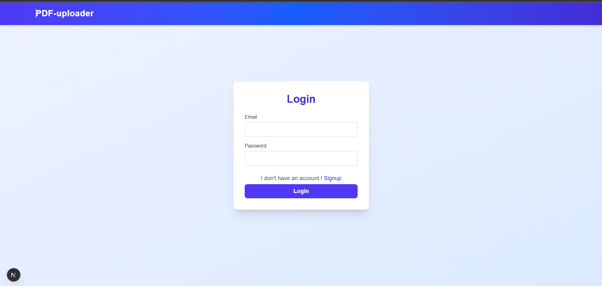
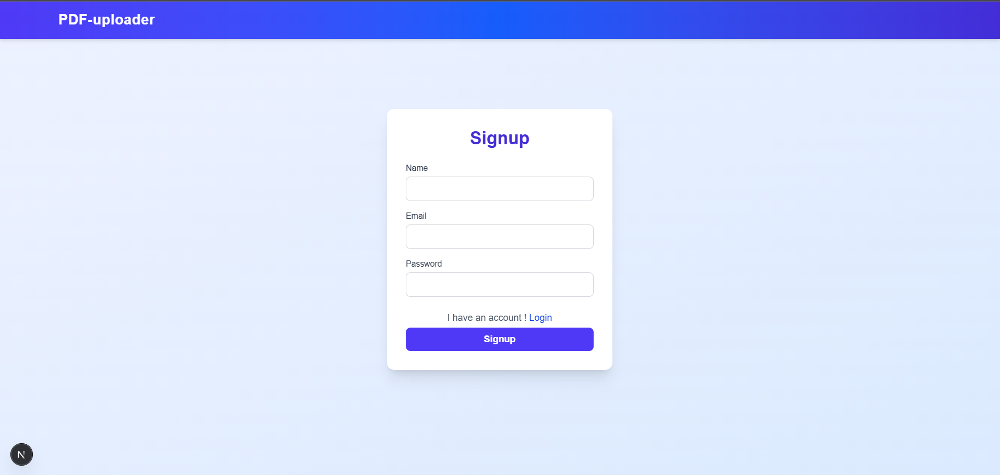
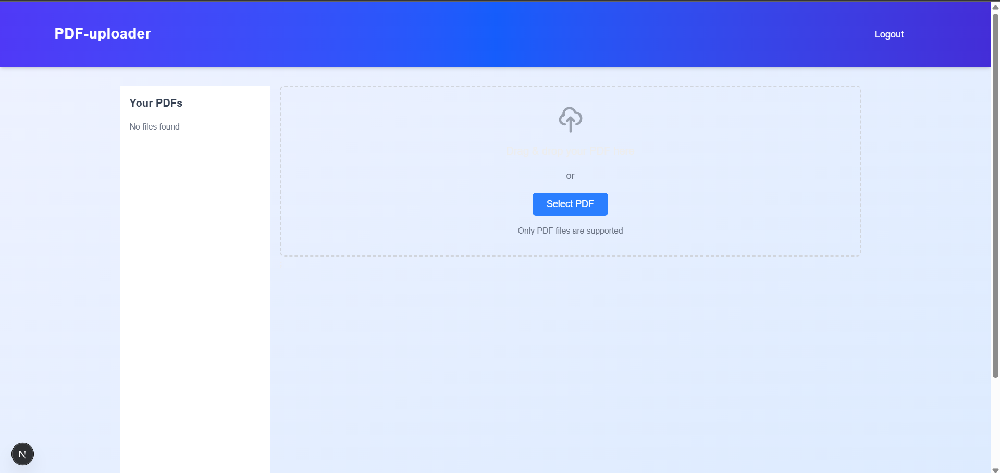
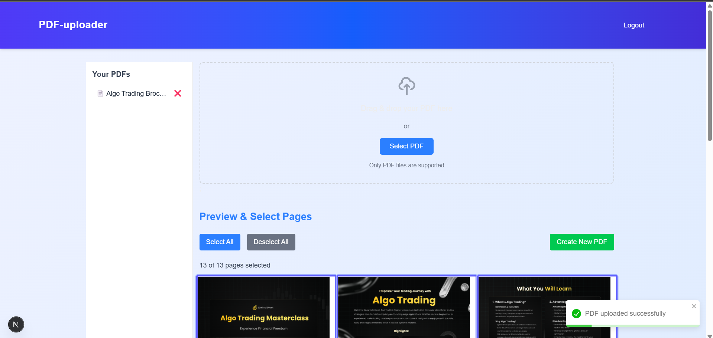
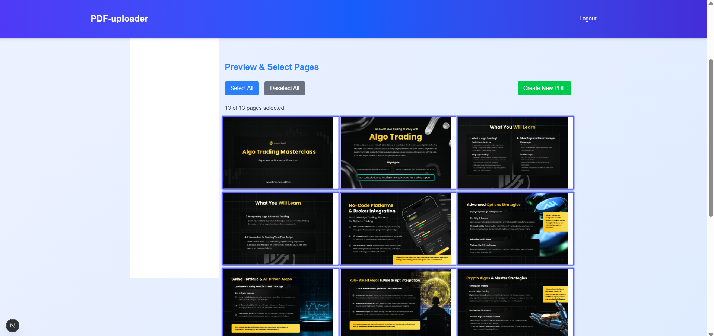
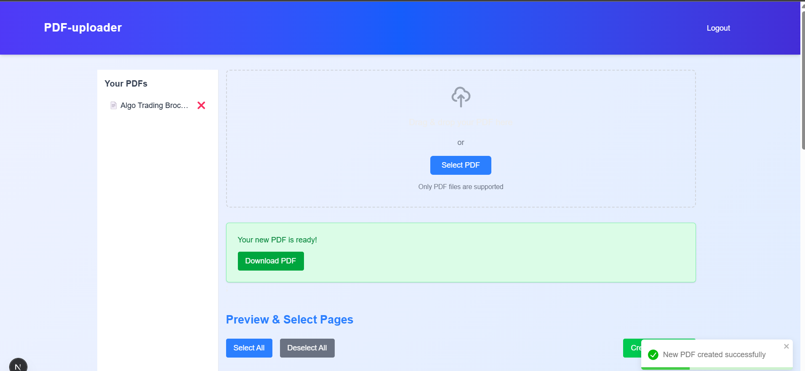

# To Start
  # Local 
    - npm run dev
    - http://localhost:3000
  # Live
    - https://pdf-uploader-client.vercel.app

# 📄 PDF Extractor Application

This is a full-stack PDF management application where users can:
- Upload PDFs
- Store PDFs
- Preview and select specific pages
- Download a new PDF from selected pages
- Delete PDFs

---

## 🚀 Tech Stack

**Frontend:**
- Nextjs 15 (React 18)
- TypeScript
- Tailwind CSS
- React-PDF
- Jotai (State management)

**Backend:**
- Node.js + Express.js (TypeScript)
- AWS S3 for file storage
- JWT Authentication
- MongoDB (via Mongoose)
- Bcryptjs for hashing
- Multer
- Other packages (For future Development)

---

## 🔧 Prerequisites

- Node.js >= 18.x
- MongoDB Atlas URI
- AWS S3 Bucket with access key/secret
- `.env` setup for both client and server

---

## 📷 Preview

### 🏠 Landing page

---

### 🔐 Login Page

---

### 🔐 Signup Page

---

### 🏠 Home Page

---

### 📤 Upload PDF

---

### 👀 Preview & Select Pages

---

### ⬇️ Download Selected Pages

